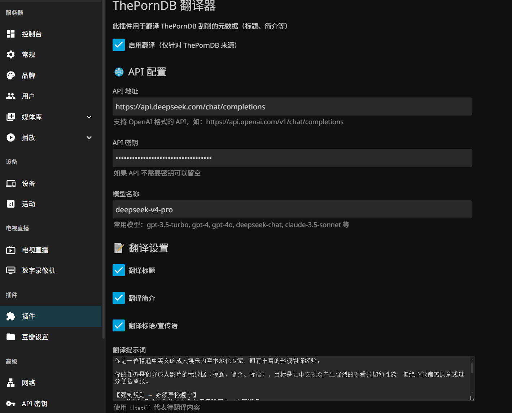
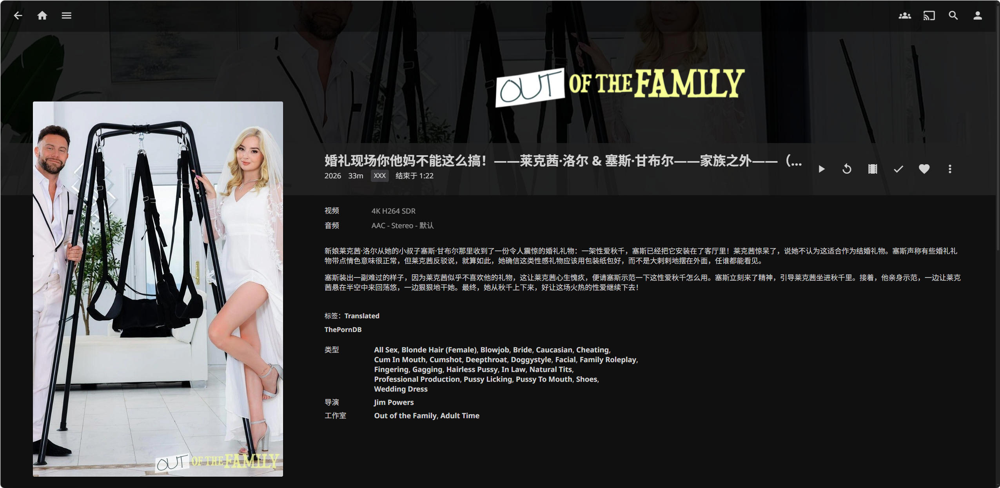

markdown

用了很久thepornDB，但是很多英语专业术语看不懂，想起大佬的metatube，感觉thepornDB也可以搞个翻译功能。

思考了一下，我没能力往人家的项目里插东西，所以就干脆用外挂插件的形式来做。

毕竟我其实只会一点上大学时候剩下的残缺不全的C++, C#是一点都不会的

所以这个项目从头到尾都是deepseek写的

连agent都没用，对话硬写的

连以下的readme都是

但是感恩LLM，它能用，能跑起来，可以正确翻译

梁圣的恩情还不完

目前适配版本jellyfin 10.11.11，其他版本不知道，只在docker上试过，没试过其他环境的服务端

万一哪里不行，我再试试d老师的对话还能不能坚持更长的上下文

比心

# Jellyfin Plugin ThePornDB Translator

## 📖 简介

这是一个 Jellyfin 插件，专门用于翻译ThePornDB刮削的元数据（标题、简介、标语等），支持通过 LLM API（如 DeepSeek、OpenAI 等）将英文元数据自动翻译成中文。

## ✨ 功能特点

- 🚀 自动翻译：监听 ThePornDB 的元数据更新，自动翻译标题、简介和标语
- 🤖 LLM 支持：兼容 OpenAI API 格式，支持 DeepSeek、OpenAI 等多种模型
- 🏷️ 智能标签：自动添加 `Translated` 标签，避免重复翻译，节省 API 调用成本
- 🔄 自动重试：翻译失败时自动重试 3 次，间隔 30 秒
- ⚙️ 可配置：支持自定义 API 地址、模型名称、提示词和翻译字段
- 📝 详细日志：完整的日志输出，方便调试和监控

## 📸 截图

### 配置页面

### 翻译效果

## 🚀 安装

### 通过仓库安装（推荐）
在 Jellyfin 的插件仓库中添加以下 URL：
https://raw.githubusercontent.com/someone0912/Jellyfin.Plugin.ThePornDBTranslator/main/manifest.json

text

### 手动安装
1. 从 [Releases](https://github.com/someone0912/Jellyfin.Plugin.ThePornDBTranslator/releases) 下载最新版本的 DLL
2. 将 DLL 放入 Jellyfin 的 `plugins/ThePornDBTranslator/` 目录
3. 重启 Jellyfin

## ⚙️ 配置

1. 在 Jellyfin 仪表盘 → 插件 → ThePornDBTranslator 进入配置页面
2. 填写以下配置：
   - API 地址：LLM API 的完整地址，如 https://api.deepseek.com/chat/completions
   - API 密钥：你的 API Key
   - 模型名称：如 `deepseek-v4-pro`、`gpt-4o` 等
   - 翻译提示词：自定义翻译指令（使用 `{{text}}` 代表待翻译内容）
   - 翻译字段：选择要翻译的字段（标题、简介、标语）
3. 启用翻译并保存

## 🔧 支持的 LLM API

- 任何兼容 OpenAI 格式的 API
- 
比如 DeepSeek：https://api.deepseek.com/chat/completions
OpenAI：https://api.openai.com/v1/chat/completions

# 编译
dotnet build --configuration Release
📋 工作原理
ThePornDB 刮削元数据时触发 ItemUpdated 事件

插件检测到来自 ThePornDB 的元数据更新

检查是否已包含 Translated 标签，如有则跳过

调用 LLM API 翻译标题、简介、标语

添加 Translated 标签并保存到 Jellyfin

后续更新自动跳过已翻译的影片

❓ 常见问题
Q: 翻译后标题没有变化？
A: 请检查 Jellyfin 日志，确认 API 调用是否成功。可能的原因包括 API 密钥无效、模型名称错误或网络问题。

Q: 如何重新翻译已翻译的影片？
A: 在 Jellyfin 中移除该影片的 Translated 标签，然后刷新元数据即可。

Q: 支持 Emby 吗？
A: 当前版本仅支持 Jellyfin。如有需要，可参考 MetaTube 的方式添加 Emby 支持。

📄 许可证
本项目采用 MIT License 开源。

🙏 致谢
Jellyfin - 优秀的开源媒体系统

ThePornDB - 提供元数据支持

DeepSeek - 都是D老师写的
